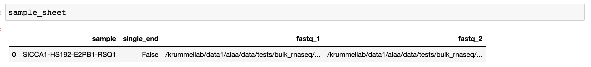

# RNAX
A computational pipeline for variant calling and expression quantification of bulk RNA-sequencing data.

N.B: The pipeline is under active development and not yet suitable for deployment.

## Pre-requisites
* familiarity with Linux Command-line system
* familiarity with Nextflow
* installation of Nextflow DSL2
* HPC usage
    * installation of Singularity and Slurm
    * you - the user - probably don't need to do this yourself!
* local usage
    * installation of Anaconda

## Installation
* clone code repository
```bash
git clone https://github.com/UCSF-DSCOLAB/data_processing_pipelines.git
```
* go into the bulk RNAseq directory
```bash
cd data_processing_pipelines/bulk_RNAseq
```
## Configuration
* Create sample sheet specifying each sample, locations of their sequencing reads (FASTQ), and whether they are single-end or paired-end reads. The figure below is an example of a correctly formatted sample sheet:

* Open `config/directories.config` using your favorite text editor, and specify the following key parameters before saving:
    * `results_directory`: for storing final results; this should be in a location that you have read-write access to
    * `input`: sample sheet filepath, MUST BE INSIDE `results_directory` path
    * `tmp_dir`: for storing temporary files generated by the different tools; it should be the same as your main temporary directory e.g. `/c4/scratch/[username]`
* Open `config/parameters.config` and adjust the pipeline parameters accordingly

### HPC Usage
* Run the DSL2 pipeline using Slurm and Singularity
```bash
sbatch ./run_pipeline.sh -c config/base.config -profile hpc
```

### Local Usage
* Run the DSL2 pipeline using Anaconda
```bash
nextflow run bulk_rna_seq.nf -c config/base.config -w your/tmp/directory -profile local
```

## Authors
Emily Flynn

Al Latif

Daniel Bunis

Walter Eckalbar