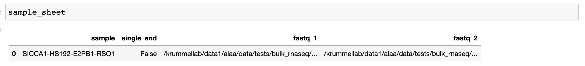

# RNAX
A computational pipeline for variant calling and expression quantification of bulk RNA-sequencing data.

## Pre-requisites
* familiarity with Linux Command-line system
* familiarity with Nextflow (optional)
* installation of Nextflow DSL2 (see Installation section below)
* HPC usage
    * installation of Singularity and Slurm
    * you - the user - probably do not need to do this yourself!
* local usage
    * installation of Singularity

## Installation
* in your `home` directory, install java
    1. `wget https://download.oracle.com/java/17/archive/jdk-17.0.7_linux-x64_bin.tar.gz`
    2. `tar -xf jdk-17.0.7_linux-x64_bin.tar.gz`
    3. `mkdir jdk`
    4. `mv jdk-17.0.7 jdk/`
    5. add the following to your `~/.bashrc`: 

    ```bash
    # global environment variables
    export JAVA_HOME="/c4/home/${USER}/jdk/jdk-17.0.7"
    export NXF_JAVA_HOME="/c4/home/${USER}/jdk/jdk-17.0.7"
    export PATH=$JAVA_HOME/bin:$PATH
    ```
* in your `home` directory, install nextflow
    1. If `bin` does not exist: `mkdir bin`
    2. `cd bin`
    3. `wget -qO- https://get.nextflow.io | bash`
    4. `chmod +x nextflow`
* clone code repository from GitHub
```bash
git clone https://github.com/UCSF-DSCOLAB/data_processing_pipelines.git
```
* go into the bulk RNAseq directory
```bash
cd data_processing_pipelines/bulk_RNAseq
```

## Configuration
* The pipeline defaults to the hg38.p13 reference and assumes its chromosome names already use the UCSC convention, so contig conversion is disabled.
* To use the hg38.p14 NCBI RefSeq reference, add `hg38_p14` to the profile list. For example, on C4 use `-profile hpc_c4,hg38_p14`. This reference automatically enables conversion of RefSeq contig accessions to UCSC-style chromosome names.
* Create a sample sheet (CSV) specifying each sample, locations of their sequencing reads (FASTQ), and whether they are single-end or paired-end reads. The figure below is an example of a correctly formatted sample sheet:
* Avoid creating the csv using Microsoft Excel because it can add weird symbols (eg. <U+FEFF>) to the beginning of the file causing issues for the pipeline

* If one or more of your samples have multiple FASTQ reads (i.e. multiple lanes), the sample sheet should contain a row for each lane with an identical name under the `sample` column
* Optional donor_id and library_id columns define the BAM read-group sample
  and library identifiers. When omitted, both default to sample. All lanes for
  one donor must use the same sample, donor_id, and library_id.
* Open `config/user_directories.config` using your favorite text editor, and specify the following parameters before saving the file:
    * `results_directory`: for storing final results; this should be in a location that you have read-write access to
    * `input_sample_sheet`: sample sheet name. THIS FILE MUST BE INSIDE `results_directory`
    * `tmp_dir`: for storing temporary files generated by the different tools; it defaults to a `tmp` directory inside `results_directory`

### Usage (on C4 compute nodes)
* Run the DSL2 pipeline using Slurm and Singularity
    * NOTE: you must run the following command inside `data_processing_pipelines/bulk_RNASeq/`
```bash
sbatch ./run_pipeline_c4.sh
```
The pipeline log and Nextflow work directory are created under `results_directory`. A small `slurm-<job-id>.out` bootstrap log is also created in the submission directory because Slurm opens its output before the pipeline configuration can be read.

#### Additional Functionality
* To resume a pipeline run on Slurm 
```bash
sbatch ./run_pipeline.sh -resume
```

### Local Usage
* Run the DSL2 pipeline using Anaconda
```bash
nextflow run bulk_rna_seq.nf -c config/base.config -w your/tmp/directory -profile local
```
#### Additional Functionality
* To resume a pipeline run on local
```bash
nextflow run bulk_rna_seq.nf -c config/base.config -w your/tmp/directory -profile local -resume
```

### Troubleshooting
* If a run fails, examine log ouputs to identify and resolve issues before resuming run
* Common cause of failure includes insufficent memory allocated for jobs (solution: for the process that ran out of memory, adjust the amount of computational resource allocated in `container.config` for _HPC Usage_ or `conda.config` for _Local Usage_)

## Genotyping output optimized for donor demultiplexing

The expression-quantification results remain unchanged. The SNP branch uses the
adapter-trimmed reads before optional rRNA removal, because rRNA filtering is an
expression-processing concern and should not discard genotype evidence.

The genotyping path is:

1. STAR two-pass alignment with donor/library read groups.
2. Retention of primary, uniquely mapped, MAPQ >= 30 reads by default.
3. Picard duplicate marking and GATK SplitNCigarReads.
4. Optional BQSR (run_bqsr=false disables it for concordance benchmarks).
5. Per-donor HaplotypeCaller reference-confidence GVCFs.
6. CombineGVCFs and GenotypeGVCFs for a consistent cohort genotype matrix.
7. Biallelic SNP selection, site filtering, and DP/GQ genotype masking.
8. PASS selection, normalization, cohort missingness filtering, and removal of
   sites that are monomorphic among the sequenced donors.
9. Optional intersection with a curated common-SNP panel and exclusion of
   RNA-editing/difficult regions.

No single-cell data or demultiplexing software is run by this pipeline.

### Recommended optional resources

For the most conservative output, provide:

    --demux_snp_panel /path/common_germline_snps.vcf.gz
    --demux_snp_panel_tbi /path/common_germline_snps.vcf.gz.tbi
    --demux_exclude_regions /path/rna_editing_and_difficult_regions.bed

The SNP panel must be normalized against the configured FASTA. The pipeline
checks panel REF alleles and stops on a mismatch. The exclusion BED should use
the same source contig names as the FASTA; contig renaming, when enabled, occurs
only after reference-dependent filtering.

Recommended panel contents are common autosomal biallelic germline SNPs. The
exclusion BED should combine known RNA-editing sites, low-mappability and
low-complexity regions, segmental duplications, problematic pseudogenes, HLA,
and mitochondrial regions.

### SNP output layout

* snps/gvcfs/: per-donor reference-confidence GVCFs and indexes.
* snps/joint/cohort.raw.vcf.gz: raw joint-genotyped cohort VCF.
* snps/filtered/: SNP-only, filter-annotated, and PASS intermediate VCFs.
* snps/demux_ready/: normalized, polymorphic, high-call-rate donor SNP VCFs.
  If an optional panel or exclusion BED is supplied, the most downstream file
  in this directory is the recommended output.
* snps/qc/: raw/final bcftools statistics, per-donor genotype metrics, and
  pairwise donor-discrimination counts.

Low-DP or low-GQ donor genotypes are converted to missing rather than homozygous
reference. The final VCF preserves GT, AD, DP, GQ, and PL when emitted by GATK.

### Important genotyping parameters

* genotype_min_mapping_quality=30
* genotype_min_depth=8
* genotype_min_gq=20
* demux_max_missing_fraction=0.20
* demux_min_pairwise_discordant_snps=50
* expression_fastp_overlap_correction=true (the independent genotyping branch
  always disables overlap correction)

These are starting values and should be benchmarked against orthogonal donor
genotypes when available. cohort.pairwise_discrimination.tsv reports WARN for
donor pairs below the configured discriminatory-SNP threshold.

## Authors
Emily Flynn (@erflynn)

Al Latif (@AlaaALatif)

Lily Zemelko (@lzemelko)

Amadeo Mazzara (@amadeovezz)

Tammie Tam (@tastam)

Daniel Bunis (@dtm2451)

Walter Eckalbar
